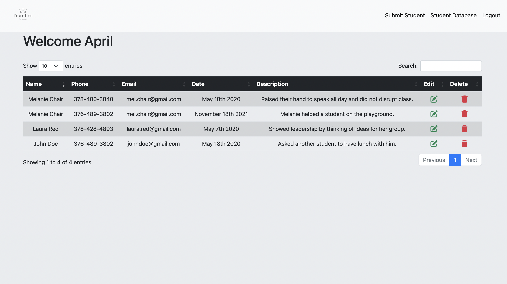

## Teacher Notebook : <a href="https://teacher-notebook-database.herokuapp.com/">Live Demo</a>

## How It's Made:

**Tech used:** EJS, CSS, Bootstrap, JavaScript, Node, Express, MongoDB, GoogleOauth20, 

I wanted to make a functional website that would be useful to teachers throughout the school year. Teachers often have to keep track of many students, write reports on their students, and also conduct meetings or conferences on each student. Therefore, I decided to make a student database so that teachers can write quick anecdotal notes on each student, and look up those notes when they are preparing report cards, progress reports, or conferences.
 
Throughout the process of building this app, my focus was structuring the code using MVC architecture. Therefore, I organized my code by a views folder that contains all of my EJS files that will render client side code. Then I made a separate folder titled server, which contains all of my backend files. This includes models for the User and Student schemas. The routes folder contains the paths that connect the controller to the views. Finally, I made a controllers folder which contains all the application logic. I also wanted to try to add Google Oauth into my project because I thought it would be a great way to validate users and organize data by the users.

## Optimizations

If I had more time, I would possibly add another option for users to sign into my database. This application assumes that everyone has a Google account or would not mind creating one. However, by adding another user validation method all users would have access.

## Lessons Learned:

By building this website, I got a deep understanding of MVC architecture. I had to do a lot of debugging to make sure all of my routes were correct, and rendering the EJS files properly. It was quite challenging, and I had to change my routes many times to get my application up and running. Also, figuring out how to properly implement Google OAuth was also very challenging. Tying the user data to the user id took a lot of research and debugging. I was finally able to find a post on Stack Overflow which mentioned that I can set the UserID in my controller by using, req.user._id. This was the key to tying the UserID to the data.
